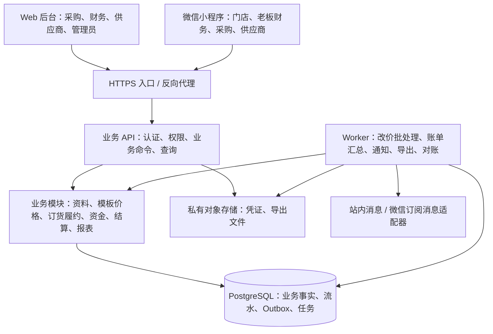
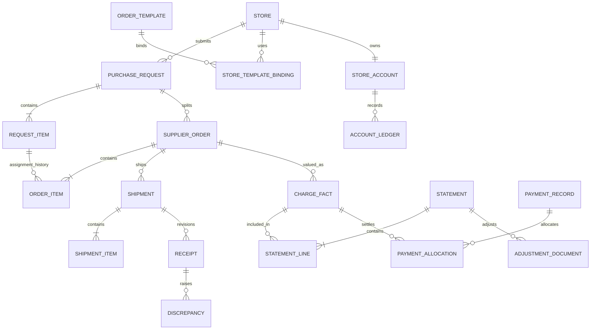
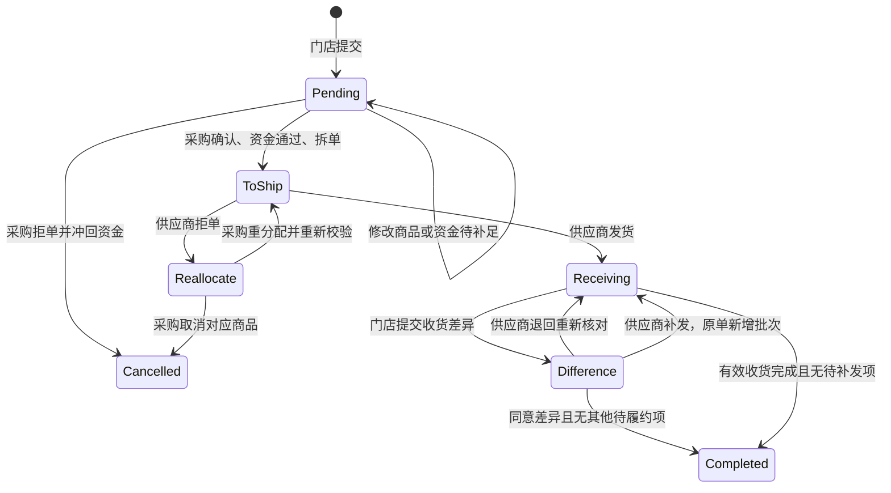
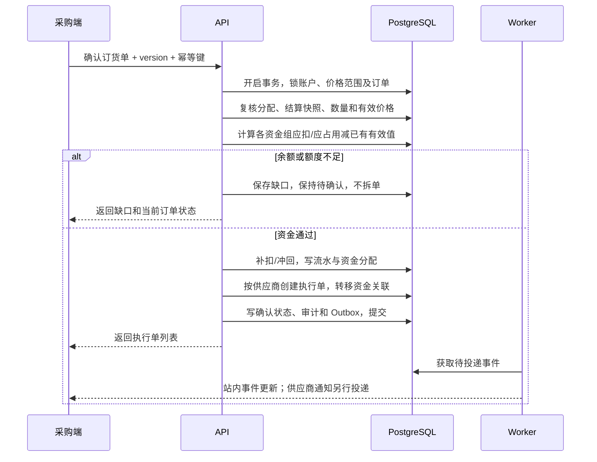

# 采购协同系统架构设计与开发方案

> 版本：v1.0 已确认
> 日期：2026-09-24
> 需求基线：[软件需求规格说明书 v1.4](./requirements.md)
> 读者：项目负责人、产品、开发、测试、运维
> 状态：用户于 2026-09-24 确认 D1-D7 全部按建议执行，作为设计与开发基线；尚未建设或经过压测。

确认说明：正文中与 D1-D7 对应的“建议”表述现为已采纳方案，不再重复征求确认。具体依赖版本、资源规格和上线配置仍在相应实施阶段确定；恢复目标的确认不代表已经通过恢复演练。

## 1. 设计结论与评审范围

需求已具备进入架构设计的条件。建议采用“一个 Web 管理后台 + 一个多角色微信小程序 + 一个模块化业务后端 + 一个关系数据库”的方案。首版以订单、资金和结算正确为重点，通过清晰的模块边界支持后续扩展。

核心设计决策：

| 决策 | 解决的问题 |
|---|---|
| 模块化单体后端，API 与后台任务分进程运行 | 小团队可部署、可调试，采购确认与资金操作可在同一数据库事务内完成 |
| 原始订货单、供应商执行订单、发货批次分层 | 支持多供应商拆单、拒单重分配、原单多次补发，保持完整来源关系 |
| 履约、门店资金、公司供应商结算分开建模 | 已支付不误判为已收货，一侧结清不误判为另一侧结清 |
| 资金流水、应收应付明细为事实来源 | 不依靠订单状态推算余额，不因两种供应商汇总单重复计账 |
| 价格版本、交易快照、差额记录并存 | 支持未完成订单历史改价，又保留发货原始记录和已完成订单价格 |
| 两端共用业务命令与权限校验 | 网页和小程序操作结果一致，客户端不能绕过资金与权限限制 |
| 数据库事务保证核心一致性，可靠任务处理通知和导出 | 消息发送失败不丢单，也不撤销已成功的业务交易 |

仓库目前只有需求及相关文档，没有已实现的业务框架。本方案按现有估算文档中的小团队、单人全栈假设设计；不沿用旧版 95 人天作为新范围承诺。

本文提供架构、逻辑数据模型、关键算法、接口边界、测试与开发顺序。完整建表迁移、逐接口 OpenAPI、页面原型在方案确认后按开发阶段交付，不把逻辑模型当成已经执行的数据库脚本。

## 2. 业务基线

以下是已确认需求，不作为本轮待定选项：

1. 门店后台维护；首版不含第三方门店同步、通用审批流、在线支付、入库出库或库存管理。
2. 每个门店只有一个有效模板；每条商品只分给一家供应商，支持按分类批选分配，禁止重复商品行绕过限制。
3. 结算方式按“模板中供应商覆盖值 > 供应商默认值”；配送方式为供应商唯一配置，不按商品或模板配置。
4. 储值充足下单扣款；不足可提交，但采购不可确认、拆单或推送。挂账超额下单仍拦截。
5. 供应商双端处理订单，只读自己的商品，不维护基础资料和价格。
6. 收货差异由门店提出，由供应商选择补发、退回门店重确认、同意差异。
7. 补发只新增履约记录，不新增订货单或执行订单；沿用原单价格及首次发货日期所属账期。
8. 未完成订单支持符合时间规则的历史改价；已完成订单不追溯。已发货订单以首次发货时间判断，补发不重新取当天价格。
9. 门店账单用销售价；供应商周期总单及分店单用供货价，共用应付明细和核销记录。
10. 未结清账单更新并留痕；已结清账单不改原值，生成关联差额调整单参与后续结算。
11. 自然周为周一至周日；半月为 1-15 日、16 日至月底；自然月按月。业务时区为 `Asia/Shanghai`。
12. 充值和清账有图片凭证、操作人、业务日期及操作时间；清账生成独立清账单。
13. 商品只有一组单位换算，起订量和订货倍数默认 1；商品差价利润独立展示，运费不计入利润。

需求冲突处理顺序：用户最新确认 > 当前 SRS > 本文技术建议 > 历史评审及旧估算。业务规则变更需先同步需求基线。

## 3. 技术架构

### 3.1 总体结构



API 与 Worker 复用同一套业务模块、同一版本代码和数据库。Worker 不另实现一套资金或改价规则。数据库是订单、价格、余额、应收应付的唯一权威来源。

首版不引入微服务、分布式事务、搜索集群、通用规则引擎或工作流引擎。只有出现明确的容量或团队分工压力后，才拆独立服务。

### 3.2 推荐技术栈

| 层次 | 推荐 | 项目适用理由与约束 |
|---|---|---|
| 工程语言 | TypeScript | 前后端共用契约和枚举，降低小团队切换成本；运行时仍必须校验输入 |
| Web | React + Vite + Ant Design | 适合表格、筛选、表单和财务工作台；按领域组织页面 |
| 小程序 | Taro + React | 共用语言及 API 契约，页面按小程序交互独立实现，不直接复用 Web UI |
| 后端 | NestJS，使用默认 HTTP 适配器起步 | 模块、依赖注入、守卫适合组织订单与财务模块 |
| 数据库 | PostgreSQL | 使用事务、行锁、精确数值、约束实现业务一致性 |
| 数据访问 | Prisma ORM，必要处使用参数化 SQL | 常规 CRUD 与迁移由 ORM 管理；行锁、条件更新和报表允许显式 SQL |
| 金额计算 | 数据库 `numeric` + 服务端十进制定点运算库 | 金额和单价禁止用 JavaScript 浮点数运算 |
| 文件 | 云对象存储私有桶 | 商品图片与收货、充值、清账凭证分区管理；凭证授权访问 |
| 异步任务 | PostgreSQL Outbox + 持久化任务表 | 减少首版基础设施；支持重试、去重、失败列表和任务进度 |
| API 契约 | REST + OpenAPI | 两端生成客户端类型；权限按各角色响应模型定义 |
| 测试 | 单元测试、真实 PostgreSQL 集成测试、Playwright Web E2E、小程序真机验收 | 核心是验证并发、金额与权限，不能仅 Mock 数据库 |
| 部署 | 容器化 API / Worker + 托管数据库 + 对象存储 | 开发测试可用 Docker Compose；生产数据库具备备份和恢复能力 |

以上是本项目选型建议，不代表框架自身保证资金正确。NestJS 提供模块与守卫等组织机制；Taro 支持 React，但小程序组件和路由遵循其平台规范。[NestJS 文档](https://docs.nestjs.com/)、[Taro React 文档](https://docs.taro.zone/docs/react-overall)。Web 表格和表单采用现成组件库。[Ant Design 文档](https://ant.design/docs/react/introduce/)

具体版本在基础工程阶段锁定到经过兼容性验证的受支持稳定版本，提交 lockfile 和运行时版本文件，不使用浮动 `latest`。Prisma 不同主要版本的事务接口有差异，实施时按锁定版本核对；事务上下文必须传递给所有参与写操作的模块。[Prisma 事务说明](https://www.prisma.io/docs/orm/fundamentals/transactions)

Redis 首版不作为资金锁或必需组件。后续如需分布式限流、缓存或更高吞吐队列，可增配 Redis；数据库约束和资金事务仍保留。

### 3.3 模块边界

| 模块 | 拥有的数据与职责 | 外部调用方式 |
|---|---|---|
| Identity | 用户、角色、权限、账号绑定、会话、数据范围 | 获取授权上下文，校验功能和对象归属 |
| MasterData | 门店、供应商、商品、二级分类、品牌、单位、唯一换算关系 | 提供资料查询与启停用校验 |
| CatalogPricing | 模板、可订商品、供应商优先级、结算覆盖、价格版本 | 解析下单配置、取价、计算改价影响 |
| Ordering | 原始订货单、商品行、分配、采购确认与拒单 | 执行提交、调整、确认、拆单命令 |
| Fulfillment | 执行订单、发货批次、收货版本、差异与补发 | 执行发货、收货、处理差异、拒单 |
| Finance | 储值账户、挂账账户、不可变流水、充值、清账 | 扣退款、占用释放、充值、清账 |
| Settlement | 两侧计价明细、账单、收付款登记、核销、调整单 | 更新应收应付、出账、确认收款、差额结转 |
| Reporting | 订货统计、利润、三种账单读模型、导出 | 只读业务事实，按权限聚合 |
| Operations | 文件、审计、Outbox、任务、消息 | 事务内记录事件，事务外投递及执行 |

跨模块只能调用公开应用服务，不直接修改其他模块的数据表。采购确认等跨模块用例由应用服务统一开启事务；内部服务接受同一事务上下文，不自行开启独立提交的事务。

代码按 `controller -> application service -> domain policy/repository` 组织。简单资料 CRUD 保持直接；资金、改价、结算采用显式规则函数，不为所有表建立多层空抽象。

## 4. 数据模型与数据库约束

### 4.1 数据分层



图中为主要关系；收货明细、价格版本、账单修订等子表见下表。逻辑表可按实际迁移拆分，但不能合并掉独立的交易事实。

### 4.2 核心表组

| 表组 / 表名建议 | 关键字段或关系 | 必须保持的规则 |
|---|---|---|
| `users / roles / permissions / user_scopes / sessions` | 账号、角色、门店/供应商归属、会话撤销状态 | 权限和归属由服务端取得，禁用账号立即失去操作能力 |
| `stores / suppliers / products` | 业务编码、状态、资料字段 | 历史引用不级联删除；删除表现为归档及解除当前关联 |
| `categories / brands / units` | 二级分类、名称、状态 | 分类最多二级；名称变化同步展示，交易快照另存 |
| `product_unit_conversion` | 商品、销售单位、采购单位、换算比例 | 每个商品最多一组有效换算；历史行保存原换算值 |
| `supplier_products` | 供应商、商品、供货状态 | 同供应商同商品唯一；报价版本单独保存 |
| `order_templates / store_template_bindings` | 名称、标签、门店、生效/失效时间 | 模板有效名称唯一；门店最多一个当前有效绑定 |
| `template_items / template_item_suppliers` | 模板、商品、候选供应商、优先级 | 模板商品唯一；候选供应商确实可供应该商品 |
| `template_supplier_settings` | 历史兼容表；当前不开放模板结算方式覆盖 | 结算方式取供应商唯一配置；新业务只维护门店×供应商周期覆盖 |
| `price_scopes / price_versions` | 价格类型、商品、供应商、模板、`effective_at`、修订号、金额 | 供货价范围为商品+供应商；销售价范围为模板+商品+供应商；版本追加保存 |
| `purchase_requests / request_items` | 门店、系统创建时间、订货日期、商品、数量、拟供应商、版本 | 一张订货单同商品一行；金额与配置有快照 |
| `supplier_orders / order_items` | 原订货单、供应商、分配版本、首次发货时间、两种单价 | 保留拒单旧版本；一条原始商品行最多一份有效分配 |
| `shipments / shipment_items` | 执行订单、首次/补发、实际发货时间、物流号、数量、运费 | 补发仍引用原执行订单；首次发货时间写入后不可被补发覆盖 |
| `receipts / receipt_items` | 发货批次、修订号、原实收量、当前有效标记、凭证 | 同批次同明细只取一个当前有效版本，旧版本留存 |
| `discrepancies / discrepancy_actions` | 来源收货、差异量、待补量、处理人、补发/退回/同意 | 可多次处理但不得重复履行同一差异数量 |
| `store_accounts / account_ledgers` | 储值余额、挂账限额、挂账占用、版本、流水前后值 | 非负余额；每次资金变化有唯一来源流水，原流水不可编辑删除 |
| `funding_allocations` | 原商品行、当前执行订单、资金方式、有效扣款/占用 | 拆单只重新关联原资金，不再次扣款；支持拒单后冲回再分配 |
| `recharge_documents / clearing_documents / clearing_items` | 门店、金额、业务日期、操作人、账户、凭证、订单关联 | 清账单只覆盖所选挂账订单；原单和流水双向可查 |
| `charge_facts / charge_revisions` | 交易链路、付款方、收款方、订单行/运费、数量、价格、金额、原周期 | 商品和运费分别记录；修订可追溯，不能用汇总结果创建第二笔应付 |
| `statements / statement_lines / statement_revisions` | 方向、交易链路、周期键、来源明细、已结清标记、版本 | 门店及供应商结算分别记录；已结清账单内容不可改写 |
| `payment_records / payment_allocations` | 付款登记、凭证、收款确认、明细分配、撤销关联 | 登记不等于核销；确认收款只核销一次；总单分店单共用分配 |
| `adjustment_documents / adjustment_items` | 原订单、原账单、原周期、新结算周期、差额、原因、来源修订 | 只记录增减差额；每侧独立生成并幂等去重 |
| `audit_logs / file_objects / document_files` | 操作、前后值、对象、文件归属 | 凭证必须关联已授权单据，禁止任意拼接访问 |
| `outbox_events / jobs / job_items / notifications / export_jobs` | 去重键、状态、重试、租约、结果、错误 | 进程重启不丢任务；任务可查询、补偿和重放 |

### 4.3 数据类型与精度

建议金额规则如下，属于实现口径，见 §14 评审项：

- 货币首版按人民币；金额 `numeric(20,2)`，单价 `numeric(20,6)`，数量 `numeric(20,6)`，换算系数 `numeric(20,8)`。明确业务最大值，写入前检查溢出。
- 接口中的金额、单价、数量以十进制字符串传输；禁止先转浮点再转回字符串。
- 全部订单行以销售单位归一，保留输入单位、输入数量及换算快照。供货价也转换为同一销售单位后计算。
- 行金额按数量乘单价四舍五入到分；订单及账单金额累加已舍入行金额，不对汇总数量重新计价。
- 商品差价利润采用同一有效数量和两种单价；明细展示销售商品金额减供货商品金额，并列明舍入口径，运费不参与。高精度公式与分值结果如出现尾差，应可解释而不能人工隐藏。
- 业务时间保存 `timestamptz`，系统按 UTC 存取，展示及周期计算使用 `Asia/Shanghai`；订货日期、付款日期等人为选择的日期用 `date`，不替代系统时间。
- 内部主键用 UUID，业务单号另设唯一字段；单号生成不能用“查询当前最大号+1”。

PostgreSQL 的 `numeric` 用于精确数值，浮点类型不能替代财务金额存储。[PostgreSQL 数值类型](https://www.postgresql.org/docs/current/datatype-numeric.html)

### 4.4 索引与完整性

优先建立以下约束和索引，后续以执行计划验证，不给所有字段机械建索引：

| 类型 | 建议 |
|---|---|
| 唯一约束 | 门店有效模板；订货单+商品；原商品行有效分配；业务幂等键；价格范围+生效时间+修订号 |
| 账单唯一键 | 交易链路+应收应付方向+双方主体+周期类型+周期起止；现结另含执行订单 ID |
| 防重计账 | 业务事件+来源行+计价修订+资金/结算方向唯一；调整单按原明细+来源修订+方向唯一 |
| 业务查询 | 订货单 `(store_id, created_at, id)`；执行单 `(supplier_id, fulfillment_status, created_at, id)` |
| 财务查询 | 流水 `(store_id, occurred_at, id)`；计价事实 `(channel, supplier_id, period_key, store_id)` |
| 价格查询 | `(price_scope_id, effective_at, revision)`；未完成订单商品和首次发货时间索引 |
| 任务扫描 | `(status, next_run_at, id)`；过期租约索引；Outbox 待发送状态索引 |
| 检查约束 | 数量非负、比例大于零、金额范围、可用余额非负；具体负数只允许出现在冲销/调整类型 |

资金不能仅靠应用层先读后写保障安全。跨行总额、清账余额、发货及实收上限等约束在持锁事务内校验；外键限制删除历史引用。

## 5. 状态模型与履约设计

### 5.1 分开保存的状态

| 对象 | 状态建议 | 说明 |
|---|---|---|
| 原始订货单 | `PENDING_CONFIRMATION / CONFIRMED / CANCELLED` | 全部执行单的完成情况另行汇总，支持部分完成/部分取消 |
| 执行订单履约 | `PENDING_SHIPMENT / WAITING_RECEIPT / DISCREPANCY / REALLOCATION_REQUIRED / COMPLETED / CANCELLED` | 缺货待补为独立标记和数量，不把付款状态塞入这里 |
| 储值资金 | `UNPAID / SHORTFALL / PAID` | 由应扣金额与有效扣款计算；退款保留独立记录 |
| 挂账资金 | `UNCLEARED / CLEARED`，另有额度缺口 | 不表示实际履约完成 |
| 账期资金，两侧分别保存 | `UNPAID / PENDING_CONFIRMATION / PARTIALLY_SETTLED / SETTLED` | 部分结清为批量登记和金额调整所需的内部状态；首版不必开放任意部分付款输入 |
| 发货批次 | `DRAFT / SHIPPED / RECEIPT_PENDING / RECEIVED` | 发货动作提交后不能编辑原始记录 |
| 收货差异 | `OPEN / RECONFIRM_REQUIRED / REPLENISH_PENDING / RESOLVED` | 处理轨迹追加记录 |

订单列表按以上维度组合成用户熟悉的“待收货”“已下单未支付”“挂账未清”等视图。原始订货单只有全部有效执行单完成或取消且无待重新分配商品，才进入履约终态汇总。

### 5.2 状态流转与权限



这是单条执行链路的示意，不代表整张原始订货单一次性流转。每个命令检查当前状态、对象归属、版本和允许动作；禁止提供可以任意改 `status` 的通用接口。

### 5.3 减量与缺货补发

发货页面必须区分“本次少发，剩余待补”与“永久减少/移除商品”。二者不能共用一个只填发货数量的含糊动作：

- 永久减量：降低履约目标，生成金额调整并退回已扣储值或释放挂账占用。
- 缺货待补：履约目标不变，记录待补数量；不能因本次少发直接关闭订单或退回整个待补货款。
- 收货少于发货：实收量先记录，差异待供应商决策；同意差异才减少最终目标，补发则保留目标。
- 发货量和有效收货量按批次归档；补发量不能超过已确认的缺货/差异待补量。

完成条件为：无未处理差异、无待补量、所有已发货批次具有有效收货结论。退回重确认只替换该批次当前有效收货版本，不能在累计数量上再加一遍。

有效实收量为各批次当前有效收货版本之和，不是所有历史收货记录之和；发货累计可因运输缺失后的补发大于目标量，但最终有效实收不能超过有效履约目标。待核对计价量为已确认有效实收加尚未收货批次的待核对发货量；已经报告少收的数量不再与对应补发重复累加。差异尚未决议时金额标记待核对，不据此自动永久退款；资金占用按履约目标和已确认减量单独计算。

### 5.4 拒单与重新分配

建议供应商拒单仅作用于未发货执行单；已发货部分走收货差异流程。旧执行单保留拒单记录并停止处理，采购基于原商品行生成新分配版本，旧资金分配冲回后按新供应商和结算快照重新核算。

同次订货同供应商仅保留一个有效执行单；拒单旧单属于历史记录。若重分配目标供应商已有未发货执行单，可事务内合并；若目标供应商已首次发货，不直接向其追加新商品，否则会把后加入商品错误归入旧账期。建议此时禁止该目标，提示采购选择其他可用供应商或取消对应商品。此并发履约边界属于本次技术评审项，见 §14。

## 6. 关键事务与并发控制

### 6.1 统一写入规则

所有充值、清账、下单、采购确认、发货、收货、改价、收款确认接口都需要 `Idempotency-Key`。服务端保存“账号/主体+动作+幂等键”、请求摘要与业务结果；同键同请求返回原结果，同键不同请求拒绝。

数据库事务内完成业务状态、资金变化、计价明细、审计和 Outbox 写入。通知、文件转换和网络调用在事务外处理；请求超时后查询命令结果，不能换新键盲目重试。

并发规则：

1. 同一门店资金账户先加行锁，相关价格范围按 ID 排序加共享/排他锁，再按固定顺序锁订货单、执行单和结算对象。所有资金相关服务遵守统一顺序。
2. 下单/确认/发货/完成使用价格范围共享锁；发布改价使用价格范围排他锁，保证读价与发布存在明确先后顺序。发布事务不逐单处理资金，避免反向锁死。
3. 数据记录有 `version`；客户端提交预期版本，变更冲突返回 `409` 并刷新，不静默覆盖。
4. 关键更新同时带余额、额度、状态或版本条件，检查受影响行数。条件不满足则整个业务事务失败。
5. 死锁及可重试事务错误使用原幂等键进行有限次数重试，超过次数返回可重试错误并记录诊断。

PostgreSQL 行锁可用于串行化同账户资金变更；锁内只做短数据库工作，不执行通知、导出和外部 API。[PostgreSQL 锁机制](https://www.postgresql.org/docs/current/explicit-locking.html)

### 6.2 提交订货单

事务内验证门店启用、模板绑定、可订商品、起订量/倍数、供应商关联；服务端重新读取模板×商品×供应商门店销售价和商品×供应商供货价，不信任客户端金额。结算方式取供应商唯一配置，账期周期按门店模板覆盖优先、供应商默认周期兜底，并保存来源快照。

建议将本次订货的储值部分作为一个资金组：余额足够则一次扣足；不足则该组不部分扣款，记录缺口并保存待确认单。混合结算时，挂账部分独立校验并占用额度；如挂账超额，整次提交回滚。该分组实现建议见 §14。

生成原始订货单、商品行、有效扣款/挂账分配、流水及通知事件。此时无供应商可操作执行订单。没有可用模板或供应商的商品不能成功提交。

### 6.3 采购确认与拆单



拆单本身不能再记一次货款。同一订货单全部供应商组均通过校验后一起确认，任何一组失败都不产生部分推送。充值仅增加余额，采购需重新发起确认。

采购编辑与正式确认分开：资金不足的编辑可以保存目标金额和待补差额，但不能假装已全额扣款；差额一旦补扣成功必须有流水及版本依据。

### 6.4 发货与收货

首次发货事务确定 `first_shipped_at` 和周期快照，核对该时点有效价格，录入本次运费并校验资金。若当前未发货且资金不足，保存待处理信息，不提交成功发货。补发不更新首次时间、不另取新价格；额外运费先取得采购费用确认。

已首次发货订单发生历史涨价缺口，允许收货，保留待补资金状态。新增发货或补发属于后续履约动作，提交前仍检查资金阻断，不能用收货放行逻辑绕过发货校验。

收货事务写批次收货版本；无差异且不存在其他待补项时完成履约，否则进入差异处理。完成前同步核对价格范围修订号，应用已经发布且适用的改价后锁定最终价格，避免异步改价任务尚未执行时提前完成漏算。

### 6.5 充值、清账与资金校验

- 充值：校验财务权限、金额和已上传凭证；同事务创建充值单、增加储值、写流水、审计、Outbox。不自动采购确认。
- 清账：锁门店账户及所选挂账订单，重算每单未清金额，核验页面金额版本；同事务写独立清账单、清账明细、流水并减少挂账未清额。履约状态不变。
- 退款或冲销：追加反向流水并引用原流水，不删除或改写历史流水；退款最多冲回该来源实际已扣净额。
- 已清挂账后发生降价/少收：已清账记录不撤掉，按对应结算调整单处理返还或抵扣，不继续释放已经归零的挂账占用。
- 调低挂账授权额不能隐式抹除未清金额；建议低于当前占用时拒绝修改并提示先清账，见 §14。

账户校验恒等式：

```text
储值余额 = 充值净额 - 消费扣款净额 + 订单退款净额
挂账未清 = 挂账占用净额 - 已清账净额 - 未清部分释放净额
挂账剩余 = 授权额度 - 挂账未清
累计挂账发生额 = 历史正向挂账发生额之和（冲销另列）
```

账户余额是可快速读取的事务内投影，流水是可复核依据。每天对账，发现差异生成异常任务并阻断相关财务写入，不能自动用任意一侧覆盖另一侧。首版为业务资金子账，不扩展为完整会计总账或税务系统。

## 7. 价格与单位设计

### 7.1 价格解析

销售价按模板+商品+所选供应商读取，供货价按商品+供应商读取；商品默认销售价只初始化模板，不在缺失模板报价时静默兜底。门店类型通过模板分组表达差异，不额外创建与模板冲突的隐含价格优先级。

每次发布追加价格版本，包含 `effective_at / created_at / operator_id / revision / change_reason`。在指定业务基准时间内选择生效时间最大的版本；同一生效时间选择最新修订。新增历史版本不能无条件覆盖后来已经存在的有效版本。

| 订单阶段 | 取价基准 |
|---|---|
| 未首次发货 | 创建时间；历史生效后创建且未完成的订单可重算 |
| 首次发货动作 | 服务端实际首次发货时间，再核对当时有效价格 |
| 已发货未完成 | 固定首次发货时间，按该时点最新有效版本重算 |
| 补发 | 使用原单当前有效价格，不使用补发当天价格 |
| 已完成 | 固定完成时最终价格，不进入重算队列 |

普通未来改价到期后对新订单及首次发货取价生效；不能把更早首次发货的补发单重算为当天价。用户选择的订货日期和补发日期都不是原单改价判断基准。

### 7.2 历史改价批处理

1. 采购提交前展示影响范围预览，包括未完成订单数、已发货数及预估资金变化。预览标注可能因并发发生变化，最终以执行结果为准。
2. 发布事务写价格版本、增加范围修订号、创建改价任务及 Outbox，立即返回任务号。
3. Worker 按订单分批处理，每单独立事务；重新判断是否完成、是否适用及当前最新价格，不能直接套用任务创建时的旧金额。
4. 同事务更新订单有效计价、资金差额、两侧应收应付及账单/调整单，记录旧新版本与金额。余额不足保存待补差额，不制造负余额。
5. 发货、采购确认、最终收货等关键命令同步检查价格范围修订，补上尚未执行的重算，防止依赖任务速度保证正确性。
6. 任务按“订单+目标价格版本/计价版本”去重，失败可重试；连续改价按当前有效版本处理，不让旧任务把新价格覆盖回去。

先提交完成的订单不受后来发布的改价影响；先提交发布的适用改价必须在订单完成前应用。以数据库锁和提交次序解决并发，不靠毫秒时间比较猜测先后。

### 7.3 单位换算

例如商品销售单位为袋，采购单位为包，`1 包 = 10 袋`：输入 `2 包` 归一为 `20 袋`，供货单价也统一到每袋。界面同时展示输入数量和归一数量，服务端重新换算校验。

起订量及订货倍数在门店下单时校验：`数量 >= 起订量` 且 `数量 / 倍数` 为整数；不是以起订量为偏移计算倍数。收货、少发及差异处理不重复套用起订量限制。修改换算关系只影响后续取配置，历史订单继续使用快照。

## 8. 结算、账单与利润

### 8.1 先明确资金往来双方

| 结算方式 | 门店侧 | 公司对供应商侧 | 计账隔离 |
|---|---|---|---|
| 储值 | 扣余额及差额退款 | 按供货价形成应付 | 门店不再次生成账期待付款 |
| 挂账 | 占额度，财务清账 | 按供货价形成应付 | 清账与公司付供应商独立 |
| 公司账期 | 销售价应收，门店登记、总部财务确认 | 供货价应付，公司登记、供应商确认 | 两侧各自有状态和核销 |
| 供应商直接账期 | 门店向供应商付款、供应商确认 | 不形成公司应收应付 | `DIRECT` 通道单独查询，不能混入 `COMPANY` 应付 |

公司账期“门店先付公司、公司再付供应商”通过付款校验实现：建议公司账期应付明细仅在对应门店应收确认结清后允许登记支付，其他方式按自身规则处理。是否允许特殊垫付不在已确认首版范围内，不自动开放。

直接账期不混入公司的商品差价利润；门店销售价与供货价允许不同，但其差额不能自动认定为公司利润，公司利润报表按已确认的交易通道口径统计。

### 8.2 单据结构与三种查询

`charge_facts` 按来源商品行及运费形成可追溯计价事实，包含方向、付款/收款主体、交易通道及原归属周期。已发货未确认收货的部分显示待核对金额；已确认收货的部分用有效实收，待补未发部分不提前增加发货账单。

三种单据这样实现：

1. 门店+供应商+周期：销售价账单；内部再按交易通道区分收款方，储值/挂账展示扣款/清账记录而非重复待付款。
2. 供应商+周期：供货价周期总单，底层包含各门店相同来源应付明细。
3. 供应商+周期+门店：给出独立可查询单号、展示及导出入口，但它是总单明细的分组投影，不再建立一套可独立增加债务的应付台账。

供应商分店单的金额、已付、未付之和分别等于总单同口径结果。直接账期另分通道，不混入公司供应商总单。两入口付款都落到同一批 `payment_allocations`。

付款登记先预占所选应付明细的可登记金额，收款方确认后成为有效核销；待确认金额不允许从另一入口再次登记。登记失败/驳回释放预占并留痕，不把财务实收状态直接改回无记录。

### 8.3 周期与出账

- 首次发货时固化供应商周期配置版本和周期起止；修改供应商周期只影响以后新订单快照，不搬动历史交易。
- 周期用当地时间的左闭右开区间计算。上半月 `[1 日 00:00, 16 日 00:00)`，下半月 `[16 日 00:00, 次月 1 日 00:00)`。
- 现结建议一张执行单对应一个结算单，不按当天把多单合为日结；补发仍关联该原单。
- 首次发货即时形成计价明细和当前周期查询视图，周期结束任务形成可追溯账单版本。任务重试不能重新增加交易额。
- 周期结束不等于财务已结清；已发货未收货明细保持“待核对”。补发新增履约量与原实收共同计算原交易有效总额，不能按原整单再入一笔。
- 周期任务按唯一周期键执行，停机后从持久化游标补跑。跨月、跨年、闰年及半月边界使用统一周期函数。

### 8.4 调整处理

| 情况 | 技术处理 |
|---|---|
| 未结清且未付款 | 更新有效明细和账单修订，保留前后金额 |
| 未结清但部分已核销 | 保留付款及核销事实，只调整剩余金额 |
| 待确认付款期间金额下降 | 保留登记原值；确认时复核最新应结额，超出部分进入多付款待处理，不能虚增核销 |
| 账单已结清 | 原账单和明细结清版本冻结；生成仅含差额的调整单 |
| 门店侧结清、供应商侧未结清 | 门店侧生成调整单，供应商侧更新原账单，分别处理 |
| 原有多次调整 | 新差额 = 当前应计总额 - 已反映在原账单及全部有效调整中的净额，避免累计重复 |

降价导致“已付款 > 新应付”时，不能用负的未付余额表示已处理；生成待返还或待抵扣记录，财务登记真实处理结果。已结清负调整单保留原交易周期，并在下一可结算周期抵扣；没有后续采购时，也应可查询并以线下返还登记结清，不能让负调整永久消失。

调整单同时保存 `original_period_key` 和 `settlement_period_key`。前者用于交易、利润追溯，后者用于本次补收、补付或抵扣；报表不把它计作新的采购量。

### 8.5 验算示例

| 场景 | 预期 |
|---|---|
| 实收 10 件，销售 12 元、供货 9 元、运费 5 元，公司账期 | 门店应付 125 元，公司供应商应付 95 元，商品差价利润 30 元 |
| 首发 10 件、门店收 8 件、供应商补 2 件并收齐 | 最终计价数量 10，不是发货累计 12；默认运费只计首次一笔 |
| 上例少收 2 件且供应商同意，不补发，原账单均未结清 | 门店调整为 101 元，供应商调整为 77 元，利润 24 元 |
| 上例原账单均已结清后才同意少收 | 原账单保留 125/95，分别生成 -24/-18 调整单；交易有效额为 101/77 |
| 15 日首次发货、17 日补发 | 全部仍归上半月；16 日普通涨价不改变补发价 |
| 同一供应商两店应付 95 和 77 元 | 总单 172 元；任一分店核销后总单同步，两个入口不能再付同一明细 |

### 8.6 报表时间口径

建议已完成订货金额和订货量按完成日期筛选，结算报表按首次发货原周期，资金流水按发生时间并支持业务日期筛选。利润只对履约完成后的最终有效数量和价格确认，默认按首次发货日期分析，可展示完成日期辅助核对；未完成订单如展示预估利润必须明确标识且不混入已确认合计。

这些默认筛选口径属于报表实现建议，见 §14。各报表展示使用的日期类型，避免同一月份数字不同却无法解释。

## 9. API、前端与权限

### 9.1 接口规范

统一前缀 `/api/v1`。查询使用 GET；业务动作使用明确的 POST 命令；资料修改采用 PATCH 并带版本。成功返回业务结果，失败返回 `code / message / traceId / details`，金额均为字符串，时间为含时区 ISO 8601。

关键命令示例：

| 接口 | 作用 |
|---|---|
| `POST /purchase-requests` | 门店下单或采购代下单 |
| `POST /purchase-requests/{id}/reassign-preview` | 按分类批选供应商，返回逐行可分配结果 |
| `POST /purchase-requests/{id}/confirm` | 资金校验、采购确认、拆单 |
| `POST /purchase-requests/{id}/reject` | 采购拒单、冲回资金 |
| `POST /supplier-orders/{id}/reject` | 供应商拒单回采购 |
| `POST /supplier-orders/{id}/shipments` | 首次或补发，后端校验剩余可发量 |
| `POST /shipments/{id}/receipts` | 本批次收货及重确认版本 |
| `POST /discrepancies/{id}/resolve` | 供应商处理补发/退回/同意 |
| `POST /prices/impact-preview`、`POST /price-changes` | 影响预览、发布价格版本及任务 |
| `GET /jobs/{id}` | 改价/导出等任务进度及失败明细 |
| `POST /stores/{id}/recharges` | 上传凭证后财务充值 |
| `POST /stores/{id}/clearings` | 对所选挂账订单清账 |
| `GET /store-statements` | 门店销售价账单 |
| `GET /supplier-statements`、`GET /supplier-store-statements` | 供货价总单和分店单 |
| `POST /payment-records`、`POST /payment-records/{id}/confirm` | 付款登记、收款方确认 |
| `GET /adjustments`、`GET /reports/profit` | 调整单和公司授权利润报表 |
| `POST /exports`、`GET /commands/{id}` | 异步导出、结果不确定时查询原命令 |

错误码至少区分 `BALANCE_INSUFFICIENT`、`CREDIT_LIMIT_EXCEEDED`、`ORDER_VERSION_CONFLICT`、`INVALID_STATE_TRANSITION`、`SUPPLIER_NOT_ELIGIBLE`、`PRICE_REFRESH_REQUIRED`、`PAYMENT_ALREADY_ALLOCATED`。资金不足可保存订货单时返回成功创建及缺口信息，不能返回一个让用户误以为下单失败的通用错误。

列表默认 20 条并限制单页上限；普通列表支持筛选分页，大数据导出使用稳定游标。导出权限与页面一致，不暴露成本字段。

### 9.2 双端页面

| 角色 | 主要页面及能力 |
|---|---|
| 门店 | 模板商品订货、购物清单、订单、按批次收货及凭证、差异进度、账款和付款登记 |
| 门店老板/财务 | 本门店统计、余额、挂账、账单、付款及历史记录 |
| 采购 | 待确认队列、资金缺口、商品修改、分类批选供应商、确认拒单、价格影响和任务进度 |
| 供应商 | 待发货、待补发、收货差异、订单查询、只读商品、供货价两类汇总、确认收款 |
| 总部财务 | 门店账户、充值、挂账额度、清账单、两侧结算、调整单、流水和对账异常 |
| 管理员 | 全部基础资料、模板、账号及权限、任务审计及业务管理 |

Web 按角色展示工作台和紧凑表格；小程序按门店、采购、供应商分包组织。供应商两端发货、差异处理、账单确认能力一致；采购两端确认和快速改价一致。表单失败保留输入；重复点击复用同一幂等键；网络恢复后先查提交结果。

离线仅保存待提交草稿，不允许离线确认发货、收货或资金成功。商品图片支持裁切和压缩；金额确认页展示后端计算结果，提交时再次校验版本。

### 9.3 身份和字段权限

建议后台创建账号及角色绑定；Web 使用账号登录，小程序登录后绑定已有业务账号。微信身份不自动获得门店或供应商权限。具体绑定方式按客户账号运营方式在基础工程阶段落地，不新增开放注册流程。

服务端统一执行“功能权限 + 数据归属 + 字段权限”：门店不能改 URL 查看其他店；供应商只能访问自己的执行订单和文件；财务不能改供应商分配；采购不能充值清账。

公司内部、门店、供应商分别定义响应 DTO 白名单。供应商响应只包含供货价，门店响应只包含销售价；利润仅采购、总部财务、管理员可见。前端隐藏列不能替代后端字段隔离，日志和导出也要遵守。

文件上传先取得授权上传会话，完成后服务端检查大小、真实类型和业务归属；凭证通过短期签名地址下载。孤立上传可定期清理，已关联财务凭证不随订单归档删除。

会话支持过期、刷新和撤销；Web 建议安全 Cookie 并防 CSRF，小程序使用安全会话令牌；登录限流、密码哈希、敏感配置不进入仓库。前后端均不记录密码、完整令牌和数据库连接密钥。

## 10. 异步任务、通知和审计

Outbox 是与业务写入同事务生成的待投递记录。Worker 通过短事务领取任务、记录租约，事务外执行外部调用，完成后标记结果；过期租约可重新领取。多个 Worker 领取时采用行锁跳过已锁任务，避免同一任务同时执行。

投递语义为至少一次，依靠业务去重达到不重复扣款、不重复出账的效果；不承诺外部消息绝对只投递一次。通知失败不影响供应商在订单列表看到已确认订单。

| 任务 | 一致性要求 |
|---|---|
| 订单与差异通知 | 站内消息保底，微信订阅消息按平台授权及可用能力发送，失败可重试 |
| 改价 | 每单事务、可暂停重试、展示成功/失败明细；关键命令仍同步校价 |
| 周期出账 | 周期键及来源明细去重，补跑不重计金额 |
| 导出 | 固定查询口径及数据版本/时间点，分批生成，完成时及下载时复核权限 |
| 每日对账 | 余额与流水、资金分配与订单、总单与分店单、调整与来源互相校验 |
| 超时收货提醒 | 可配置阈值、频次和去重，按 SRS 规划能力实现；渠道与阈值在上线配置确认 |

导出文件保存查询条件、操作者、生成时间和计价截止信息。需要严格一致快照的大导出使用一致性快照读取或先固化导出行，不能跨多次查询混合改价前后结果。

审计事件至少含操作者、角色、操作对象、请求追踪号、操作前后差异、业务理由、客户端、服务端时间。价格、结算、凭证、权限和模板修改均可追溯；高敏字段脱敏。

## 11. 部署、容量与恢复

### 11.1 环境与发布

开发、测试、生产分离数据库、对象存储与小程序配置。生产建议反向代理后至少支持 API 滚动替换，Worker 独立资源限额，数据库和对象存储使用托管服务。预算较低可先单台应用机部署 API/Worker，但应用机故障会造成停服，此风险需在部署评审时明确。

首版不预设 Kubernetes。静态 Web 文件可通过静态托管或反向代理提供；数据库仅内网访问，API 通过 HTTPS 对外；生产迁移由发布任务单独执行，不能每个实例启动时同时改表。

发布采用新增兼容字段、双版本兼容、数据回填、后续清理的顺序。程序回滚不回滚已发生的财务事实；涉及不可逆数据迁移时保留旧兼容结构并采用前向修复。

### 11.2 容量与性能

尚未获得实际门店数、供应商数、每日订单及峰值，因此不给出未经验证的机器规格承诺。压测先覆盖建议数据集：100 家门店、50 家供应商、1 万商品、100 万历史订单、平均每单 20 行；这些是测试假设，不是客户已确认规模。

| 指标 | 设计与验证方式 |
|---|---|
| 列表 1 秒、报表 3 秒 | 建议用服务端 p95 评估，记录数据量、并发、机器和 SQL 计划 |
| 小程序首屏 2 秒 | 实机、固定 4G 网络条件，分别测试冷启动及再次进入 |
| 并发下单 200 QPS | 保留 SRS 规划目标；分别压测多门店及同一门店热点，验证吞吐、延迟和账户串行等待 |
| 10 万行导出 10 秒 | 保留目标但采用异步任务；分别测受理耗时和生成耗时，不把快速返回任务号当成导出达标 |
| 历史改价 | 测 100/1000/10000 受影响订单的任务耗时、锁等待及正常下单影响 |

未达标时先依据慢 SQL 优化索引、批量读取和统计投影，再扩 API/Worker；热点同门店资金操作必须保持串行正确性，不为吞吐放松余额校验。

### 11.3 监控与恢复目标

监控 API 错误率、p95、数据库连接及锁等待、账户对账异常、任务积压、改价失败、出账失败、消息失败和存储容量。业务日志贯穿订货单、执行单、资金单及任务号。

建议试运行恢复目标为 RPO 不超过 15 分钟、RTO 不超过 4 小时，需结合预算和托管数据库能力确认。使用数据库持续备份/时间点恢复及对象存储版本或备份策略；上线前在独立环境完成恢复演练。

恢复后先核对业务流水、账单及未完成任务，再恢复财务写入；外部线下付款可能已发生，需凭原登记和凭证核查，不能因数据库恢复自动再付款。备份恢复验证包括凭证文件，不能只验证数据库能启动。

## 12. 工程结构与开发顺序

### 12.1 推荐目录

```text
apps/
  api/                    # HTTP 入口，业务模块
  worker/                 # 任务入口，复用后端业务模块
  admin-web/              # Web 管理后台
  miniapp/                # 多角色小程序
packages/
  contracts/              # 公开 API 类型、枚举、错误码
  backend/                # 共用领域模块及基础设施
  test-fixtures/          # 测试业务场景与工厂
database/
  migrations/             # 有序数据库迁移与约束
  seeds/                  # 角色权限、字典、测试基础资料
infra/
  compose/                # 本地及测试依赖
  deploy/                 # 容器、发布和运维配置
docs/
  requirements.md
  architecture-design.md
```

服务端计算逻辑不打包给小程序；客户端只共享契约和非敏感工具。API/Worker 共用数据库仓储及业务实现，避免通过复制代码实现复用。

### 12.2 按业务闭环交付

| 阶段 | 交付内容 | 进入下一阶段的条件 |
|---|---|---|
| M0 方案确认与技术验证 | 确认 §14；锁版本；验证事务行锁、小程序登录上传、私有文件访问 | 核心依赖兼容，账号及部署路径明确 |
| M1 基础与资料 | 工程、CI、鉴权、角色、门店供应商商品、模板、价格版本 | 可按模板解析可订商品、供应商及结算方式，权限测试通过 |
| M2 下单与资金 | 原始订货单、储值/挂账、充值、采购修改、确认拆单、拒单冲回 | 双请求竞争余额、重复确认、混合结算均不重扣或透支 |
| M3 双端履约 | 供应商双端、首次发货、减量、物流号、收货、差异、补发、重分配 | 正常及异常链路贯通，补发无新订单、无重复数量 |
| M4 价格与结算 | 历史改价、三种单据、付款核销、清账、调整单 | 两侧账款一致、总分单一致、已结清调整及并发改价测试通过 |
| M5 报表与运营 | 利润、月统计、导出、消息、审计、对账异常 | 权限隔离、报表口径及重试恢复通过 |
| M6 验收上线 | 全量 AC 验收、真机、压测、恢复演练、数据初始化、试运行 | 客户按真实业务样例验收，财务余额及未结款初始化对平 |

每阶段同时交付后端、必要页面、迁移和自动化测试；核心财务模型从 M2 建立，不到 M4 才补资金约束。历史改价接口可在 M1 准备，但在 M4 全链路验证前不宣称该功能可交付。

单人开发按上述顺序完成；多人可在契约确定后并行 Web、小程序和后端，但不能省略跨端联调。完成 M0 的技术验证和细化任务后重估工时，同步 `estimation.md` 与 Excel，再形成可承诺排期。

### 12.3 上线初始化

客户准备门店、供应商、商品、模板价格、期初储值、未清挂账及供应商未结款清单。首版门店由后台维护；开发初始化工具不等于第三方同步或新增客户批量导入功能。

建议上线从明确截止日切换：期初余额通过专用期初单及流水导入并复核；历史订单是否迁移由上线范围单独约定，不能把期初余额伪造为日常充值或把历史未结款伪造为当天采购。财务对平后才能开放正式交易。

## 13. 测试与验收追踪

### 13.1 必测风险

| 类型 | 场景与断言 |
|---|---|
| 并发余额 | 余额 500 元，两笔各 400 元同时请求，只能扣成一笔；另一笔待补，不透支 |
| 并发挂账 | 可用额度 500 元，两笔各 400 元同时下单，一笔成功，另一笔拦截 |
| 幂等 | 双端重复确认、充值、清账、发货、核销，只产生一次有效事实和资金变化 |
| 中途故障 | 在扣款后、拆单前注入数据库失败，全部回滚；提交后响应丢失，重试返回原结果 |
| 混合结算 | 多供应商含储值/挂账/账期，储值不足不得部分推送，挂账超额不能保存成功订单 |
| 改价并发 | 发布改价与采购确认/发货/完成竞争，验证锁顺序、最终价格及任务重试 |
| 有效价格 | 即刻、未来、历史、同时间多修订、后来版本覆盖范围、完成单不改 |
| 履约数量 | 永久减量与待补区分；少收补发、反复退回确认、多批次补发不重计 |
| 账期边界 | 15/16 日、月底、年末、闰年、周日/周一，补发始终原周期 |
| 资金调整 | 取消、退款、涨价不足、运费增补、已清挂账降额、结算方式变更 |
| 账单调整 | 未结清更新、已结清生成差额、多次调整净额正确、负调整可结清 |
| 两侧结算 | 一侧已结清另一侧未清，分别处理；直接账期不生成公司应付 |
| 供应商两入口 | 总单与分店单同时登记付款，同一应付不能被重复预占或核销 |
| 单位精度 | 包/袋换算、六位小数、分值舍入、换算变更不影响历史 |
| 权限 | 猜测其他门店/供应商 ID、绕过前端直接调接口、导出及凭证成本泄露 |
| 恢复 | Worker 在执行中崩溃后重领，任务不丢不重计；数据库和凭证恢复对平 |

金额、周期、分配规则用单元测试；锁、唯一键、事务和双端竞争用真实 PostgreSQL 集成测试；Web 主流程用 Playwright；小程序必须通过开发者工具及真机检查上传、网络重试、角色入口和消息路径。

### 13.2 与需求验收映射

| SRS 验收项 | 设计章节 |
|---|---|
| AC-01/02/10，AC-E10 | §4、§5.4、§6.2-6.3：代下单、分配、拆单、重分配 |
| AC-03/07/23，AC-E02/03/06/07/08/09 | §5、§6.4、§10：发货、物流、收货差异、补发、提醒 |
| AC-04/05/06/12/16/17/24，AC-E01/04/05/11 | §6：储值、挂账、确认拦截、充值、清账及资金调整 |
| AC-09/13/26/27 | §7、§8.3：有效价格、补发价格、原周期 |
| AC-11/18/19/20/21/22，AC-E12/13 | §2、§8：结算继承、三类账单、核销及调整 |
| AC-08/14 | §8.5-8.6、§9：统计与利润 |
| AC-15/25 | §3.3、§9：资料维护与供应商只读权限 |

首版完成标准：全部 SRS 验收项可复现，资金与账单不变量通过，对账无未解释差异，生产恢复演练完成，两端角色权限验证通过。性能另提供带测试环境及数据规模的报告。

## 14. 已确认的设计决策

确认记录：2026-09-24，用户确认以下 D1-D7 全部按推荐方案执行。影响业务的 D2-D6 已同步到 SRS v1.4 §1.4；本表为后续开发及验收依据。

| 编号 | 已确认方案 | 实施影响 |
|---|---|---|
| D1 架构与技术栈 | TypeScript、React、Taro、NestJS、PostgreSQL、Prisma；模块化单体，独立 Worker | 建立工程时验证依赖兼容性并锁定版本 |
| D2 金额与数量 | 人民币；价格录入及展示 2 位、数量最多 6 位，底层价格保留换算精度；行金额先舍入；利润展示采用销售商品金额减供货商品金额 | 决定数据库精度、报表尾差和测试结果 |
| D3 混合结算扣款 | 一次订货的储值组足额才整体扣款，不足不部分扣；挂账组占额度但超额则整次下单失败 | 决定多供应商混合支付时资金占用与缺口展示 |
| D4 拒单后目标限制 | 只能并入未发货目标执行单；已有首次发货的目标供应商不再追加该订货单新商品 | 分配接口和页面均执行限制，保留拒单历史 |
| D5 财务边界 | 直接账期两价独立且差额不计公司利润；公司账期对应门店收款结清后可付款给供应商；挂账额度不能调低到当前占用以下 | 配置、付款及额度修改接口执行对应校验 |
| D6 报表与现结 | 订货统计按完成日，利润默认按首次发货日且仅统计已完成；现结按执行单逐单结算 | 决定默认筛选口径和现结单据颗粒度 |
| D7 部署与恢复 | 托管 PostgreSQL、私有对象存储；RPO 不超过 15 分钟、RTO 不超过 4 小时 | 按目标选择资源并验证恢复；具体云环境、预算、规模及性能验收环境在部署阶段明确 |

本轮架构决策已全部确认，可进入基础工程及数据库详细设计。资源规格、账号绑定细节、通知阈值和历史数据迁移清单在相应阶段补齐，必须在生产上线前明确，不重复开启本轮架构评审。

## 15. 参考与后续产物

业务依据：[需求文档](./requirements.md)、[客户价值汇报](./customer-value-report.md)。旧估算见 [开发估算](./estimation.md)，其数值仍需按本设计重估。

技术能力参考已于 2026-09-24 核对官方文档；具体实现以基础工程阶段锁定版本为准：

- [NestJS 官方文档](https://docs.nestjs.com/)
- [Taro React 概述](https://docs.taro.zone/docs/react-overall)
- [Ant Design React 文档](https://ant.design/docs/react/introduce/)
- [PostgreSQL 显式锁](https://www.postgresql.org/docs/current/explicit-locking.html)
- [PostgreSQL 数值类型](https://www.postgresql.org/docs/current/datatype-numeric.html)
- [Prisma 事务与事务上下文](https://www.prisma.io/docs/orm/fundamentals/transactions)

方案通过后交付：带约束索引的数据库迁移、OpenAPI 契约、角色页面原型、关键规则测试样例、部署恢复手册，以及重新估算后的里程碑计划。本文不代表这些产物已经实现。
