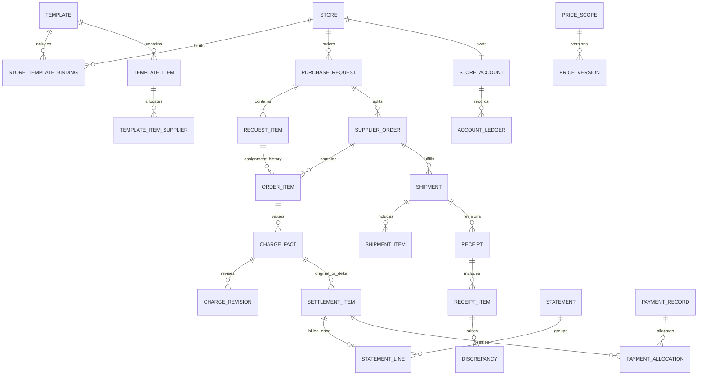

# 数据库详细设计

> 版本：v1.0 详细设计评审稿，2026-09-24
> 基线：[需求 v1.4](./requirements.md)、[已确认架构](./architecture-design.md)
> 状态：文档设计，未执行建表或迁移。D1-D7 已确认，本稿细化其实现。

## 1. 设计范围与命名

数据库采用 PostgreSQL，首版服务一个公司，不扩展成多租户平台。本设计使用英文蛇形表名和字段名，接口使用对应的 camelCase。与架构中的逻辑表名差异以本文的细化说明为准，不改变业务含义。

类型缩写：`ID=uuid`、`T=timestamptz`、`D=date`、`M=numeric(20,2)`、`Q=numeric(20,6)`、`R=numeric(20,8)`、`S=varchar(200)`。`?` 表示可空，其他字段默认必填。短代码为 `varchar(64)`；备注为 `text`。金额币种固定 CNY。时间以服务端为准，周期按 Asia/Shanghai 计算。

通用字段约定：

| 类型 | 字段 | 规则 |
|---|---|---|
| 所有实体 | `id ID`、`created_at T` | 主键，默认生成 UUID；创建时间不可被业务日期替代 |
| 可变实体 | `updated_at T`、`version int=1` | 修改时递增版本；写入携带预期版本 |
| 主数据 | `archived_at T?` | 归档而非删除历史引用；启停用与归档分开 |
| 业务操作 | `created_by ID` | 引用用户；后台任务记录触发者和任务 ID，不能伪装成其他用户 |
| 单据头 | `document_id ID` | 引用统一单据索引，唯一；金额和状态仍在所属业务模块 |

主数据名称、地址、联系方式、单位和交易价格在下单时形成快照。分类、品牌、单位名称可按 SRS 展示当前名称，但原交易名称及换算值可追溯。JSONB 仅承载快照、审计差异和任务输入，不代替商品行、核销行或可查询资金字段。

## 2. 关系总览

新增 `settlement_items` 是将架构的计价事实与可核销明细显式分开：一份事实可以有原货款及后续差额，但供应商总单与分店单永远引用同一组可核销明细，不额外产生债务。

## 3. 账号与基础资料

### 3.1 账号和数据权限

| 表 | 字段（通用字段除外） | 约束与用途 |
|---|---|---|
| `users` | `username varchar(64)`、`password_hash text`、`display_name S`、`status ENABLED/DISABLED`、`auth_version int` | 用户名唯一；不存明文密码 |
| `roles` | `code varchar(64)`、`name S` | 初始化 STORE、STORE_FINANCE、SUPPLIER、PURCHASER、HQ_FINANCE、ADMIN |
| `permissions` | `code varchar(100)`、`name S` | 精确到命令与字段查询，如 `orders.confirm`、`finance.clear`、`reports.profit` |
| `user_roles` | `user_id ID`、`role_id ID` | 联合唯一，均为外键 |
| `role_permissions` | `role_id ID`、`permission_id ID` | 联合唯一 |
| `user_scopes` | `user_id ID`、`scope_type COMPANY/STORE/SUPPLIER`、`store_id ID?`、`supplier_id ID?` | 门店/供应商范围仅对应一个非空外键；COMPANY 两者空；同用户同范围唯一 |
| `sessions` | `user_id ID`、`token_hash text`、`client WEB/MINIAPP`、`expires_at T`、`revoked_at T?`、`auth_version int` | token hash 唯一，刷新轮换；原始令牌不落库 |
| `external_identities` | `user_id ID`、`provider WECHAT`、`app_id S`、`subject_id S` | provider+app_id+subject_id 唯一，绑定已有业务账号 |

角色控制“可做什么”，数据范围控制“对谁做”。账号多角色不能自动把门店或供应商数据扩到其他主体；每个请求有明确活动身份并独立校验。首版界面不因底层支持多个绑定而额外承诺多公司管理。

### 3.2 门店、供应商、商品

| 表 | 字段 | 约束与默认值 |
|---|---|---|
| `stores` | `code varchar(64)`、`name S`、`group_name S?`、`type DIRECT/FRANCHISE/JOINT`、`contact_name S`、`phone varchar(32)`、`province/city/district S`、`address text`、`receiver_name S`、`receiver_phone varchar(32)`、`receiver_address jsonb`、`status ENABLED/DISABLED` | code 唯一；地址和收货信息均必填；财务字段不放本表 |
| `suppliers` | `code varchar(64)`、`name S`、`contact_name S`、`phone varchar(32)`、`address text`、`delivery_method SELF/LOGISTICS`、`settlement_method`、`settlement_cycle`、`cycle_note text?`、`freight_enabled bool=false`、`bank_name S`、`bank_account_name S`、`bank_account_no varchar(128)`、`tax_id S`、`invoice_title S`、`type HQ/DIRECT_STORE?`、`remark text?`、`status` | 唯一配送方式；四选一默认结算；银行资料按权限返回 |
| `categories` | `name S`、`parent_id ID?`、`level int` | 根为一级，子为二级；禁止三级与循环；同父节点有效名称唯一 |
| `brands` | `name S` | 有效名称唯一；存在当前商品关联时禁止删除 |
| `units` | `name varchar(32)` | 有效名称唯一；更名不改历史换算系数 |
| `products` | `code varchar(64)`、`name S`、`barcode S?`、`item_no S?`、`category_id ID`、`brand_id ID?`、`sales_unit_id ID`、`default_sales_price Q`、`minimum_quantity Q=1`、`order_multiple Q=1`、`storage_condition NORMAL/FROZEN/CHILLED/WARM?`、`image_file_id ID?`、`admin_remark text?`、`status` | code 唯一；价格不小于 0；起订量和倍数大于 0 |
| `product_unit_conversions` | `product_id ID`、`purchase_unit_id ID`、`sales_units_per_purchase_unit R` | product 唯一；比例大于 0；无此行即未启用采购单位 |
| `supplier_products` | `supplier_id ID`、`product_id ID`、`status` | supplier+product 唯一；解除关联归档，不删除报价历史 |

结算枚举固定为 `STORED_VALUE / CREDIT / SUPPLIER_TERM / COMPANY_TERM`；周期固定为 `IMMEDIATE / WEEK / HALF_MONTH / MONTH`。API 不允许自定义产生第五种结算方式。

## 4. 模板和价格

| 表 | 字段 | 唯一键与规则 |
|---|---|---|
| `order_templates` | `name S`、`tag S`、`remark text?`、`status` | 有效名称唯一；复制后名称仍需唯一 |
| `store_template_bindings` | `store_id ID`、`template_id ID`、`bound_at T`、`unbound_at T?` | `store_id WHERE unbound_at IS NULL` 唯一；解绑留历史 |
| `template_items` | `template_id ID`、`product_id ID`、`minimum_quantity Q`、`order_multiple Q`、`removed_at T?` | 有效 template+product 唯一；初始规则复制商品值 |
| `template_item_suppliers` | `template_item_id ID`、`supplier_product_id ID`、`priority int`、`removed_at T?` | 同条目供应商唯一；有效优先级唯一；关联商品必须一致 |
| `template_supplier_settings` | `template_id ID`、`supplier_id ID`、`settlement_override enum?` | template+supplier 唯一；空值继承供应商默认 |
| `price_scopes` | `kind SUPPLY/SALE`、`product_id ID`、`supplier_id ID`、`template_id ID?`、`revision int` | SUPPLY 模板为空，商品+供应商唯一；SALE 模板非空，三者唯一 |
| `price_versions` | `scope_id ID`、`effective_at T`、`revision int`、`unit_price Q`、`reason text`、`created_by ID` | scope+revision 唯一；生效时间相同时用最新修订；价格记录追加而非覆盖 |
| `price_change_runs` | `document_id ID`、`job_id ID`、`status`、`impact_summary jsonb` | 关联价格发布和重算结果；每次发布记录实际影响 |
| `price_change_run_versions` | `run_id ID`、`price_version_id ID` | 一次直接账期同价发布可关联两个价格范围版本 |

同一有效价查询按 `effective_at <= 业务基准时间`，再按 `effective_at DESC, revision DESC` 取一条。未来版本提前保存，但不能提前应用。历史改价插入早期时间点，不覆盖时间线上其后已存在的有效价格。

直接账期要求有效销售价与供货价一致。发布涉及此配置时校验受影响的有效时间段；需要两价联动时在同一发布命令内提交，不允许先后提交造成中间不一致。模板覆盖、供应商默认结算修改也执行此校验。

复制模板仅复制配置，不复制门店绑定和旧发布历史；为新模板建立独立价格范围和初始有效版本。删除模板关闭当前关联，历史快照及价格版本保留。

## 5. 单据、订货及分配

### 5.1 单据公共索引

`business_documents`：`id ID`、`document_no varchar(64)` 唯一、`kind enum`、`created_by ID`、`created_at T`。种类包含订货、执行订单、发货、收货、价格变更、充值、清账、账单、付款、调整、差额处置、期初单。该表只统一编号、附件归属和审计引用，不承担业务状态。

各业务头的 `document_id` 是外键且唯一；事务校验类型一致。明细不另外创建公共单据。业务编号可读，不能用“最大编号加一”生成。

### 5.2 订货与执行单字段

| 表 | 字段 | 约束与快照 |
|---|---|---|
| `purchase_requests` | `document_id ID`、`store_id ID`、`template_id ID`、`order_date D`、`status PENDING_CONFIRMATION/CONFIRMED/CANCELLED`、`submitted_at T`、`confirmed_at T?`、`store_snapshot jsonb`、`template_version int`、`remark text?` | 系统 submitted_at 为未发货取价基准；用户 order_date 仅业务日期 |
| `request_items` | `request_id ID`、`product_id ID`、`quantity Q`、`proposed_supplier_id ID`、`sales_price_version_id ID`、`supply_price_version_id ID`、`sales_unit_price Q`、`supply_unit_price Q`、`settlement_method`、`settlement_source TEMPLATE/SUPPLIER`、`settlement_config_snapshot jsonb`、`unit_snapshot jsonb`、`product_snapshot jsonb`、`removed_at T?` | request+product 唯一；删后再加复用原商品行并审计，禁止重复行拆数量 |
| `supplier_orders` | `document_id ID`、`request_id ID`、`store_id ID`、`supplier_id ID`、`assignment_revision int`、`active bool`、`fulfillment_status`、`settlement_method`、`settlement_cycle_snapshot`、`supplier_snapshot jsonb`、`first_shipped_at T?`、`period_start D?`、`period_end_exclusive D?`、`period_key varchar(128)?`、`completed_at T?`、`price_revision int`、`funding_block_reason enum?` | request+supplier 在 active=true 时唯一；首次发货前周期为空 |
| `order_items` | `supplier_order_id ID`、`request_item_id ID`、`product_id ID`、`active bool`、`target_quantity Q`、`sales_unit_price Q`、`supply_unit_price Q`、`sales_price_version_id ID`、`supply_price_version_id ID`、`effective_received_quantity Q=0`、`unit_snapshot jsonb`、`valuation_revision int` | request_item 在 active=true 时唯一；目标量包括待补，不等于累计物理发货量 |
| `order_events` | `request_id ID`、`supplier_order_id ID?`、`action enum`、`reason text?`、`before jsonb`、`after jsonb`、`command_id ID` | 记录确认、拒单、分配、减量和状态变化；追加记录 |
| `order_valuations` | `order_item_id ID`、`revision int`、`quantity Q`、`sales_unit_price Q`、`supply_unit_price Q`、`sales_amount M`、`supply_amount M`、`reason enum`、`source_document_id ID` | order_item+revision 唯一；原发货价与有效结算价均可追溯 |

拒单旧执行单 `active=false`，保留其行和处理历史；新有效分配仍引用原 request_item。对同次订货已首次发货的供应商禁止追加商品。部分取消只影响相应商品的资金分配，不退掉其他供应商资金。

订单金额汇总可以缓存，但金额来源是有效计价行。原始订货单履约进度由有效执行单及待重分配商品共同归纳，不采用某一子单状态覆盖父单。

## 6. 发货、收货和差异

| 表 | 字段 | 约束 |
|---|---|---|
| `shipments` | `document_id ID`、`supplier_order_id ID`、`sequence int`、`kind INITIAL/REPLENISHMENT`、`shipped_at T`、`delivery_method_snapshot`、`tracking_no varchar(100)?`、`freight M=0`、`freight_confirmation_id ID?` | order+sequence 唯一；每执行单仅一个 INITIAL；补发不另建订单 |
| `shipment_items` | `shipment_id ID`、`order_item_id ID`、`quantity Q`、`sales_price_snapshot Q`、`supply_price_snapshot Q`、`valuation_revision int` | shipment+order_item 唯一；正数；所属执行单必须一致 |
| `receipts` | `document_id ID`、`shipment_id ID`、`revision int`、`supersedes_id ID?`、`is_current bool`、`submitted_at T` | shipment+revision 唯一；每批次一个 current 版本 |
| `receipt_items` | `receipt_id ID`、`shipment_item_id ID`、`received_quantity Q` | receipt+shipment_item 唯一；0 至本次发货量；禁止跨批次 |
| `discrepancies` | `receipt_item_id ID`、`order_item_id ID`、`missing_quantity Q`、`status OPEN/RECONFIRM_REQUIRED/REPLENISH_PENDING/RESOLVED/SUPERSEDED` | 来源收货行+处理轮次唯一；历史差异随收货修订保留 |
| `discrepancy_actions` | `discrepancy_id ID`、`action REPLENISH/RETURN/ACCEPT`、`quantity Q`、`reason text?`、`created_by ID`、`command_id ID` | 仅供应商对应账号及授权管理员处理；命令去重 |
| `fulfillment_gaps` | `order_item_id ID`、`source INITIAL_SHORTAGE/RECEIPT_DIFFERENCE`、`discrepancy_id ID?`、`quantity Q`、`closed_quantity Q` | 首次少发也有待补来源，不能只依赖收货差异 |
| `gap_shipments` | `gap_id ID`、`shipment_item_id ID`、`quantity Q` | 关联本次补发消耗的缺口；可分次消耗，不得超出未消耗量 |
| `freight_confirmations` | `supplier_order_id ID`、`amount M`、`reason text`、`confirmed_by ID?`、`confirmed_at T?`、`status PENDING/CONFIRMED/REJECTED/USED` | 额外补发运费由采购确认；最多被一个批次使用，不是通用审批流 |

归属关系用复合外键或同事务约束校验：例如 `(shipment_id, order_item_id)` 必须属于同一执行单，不能只检查两个 ID 各自存在。所有跨行数量上限在锁住执行单、缺口后计算。

累计有效实收 = 每批次当前有效收货版本的实收之和。退回重确认切换 current 标记并重新投影，不把新旧两版相加。补发在运输缺失场景可能使物理发货累计大于目标，但有效实收不得超过目标。

少发保留待补时目标量不变；永久减量或同意少收才降低目标并释放资金。重复补发通过 gap_shipments 的已消耗量和锁内校验拦截。已关联后续补发的旧收货版本不能被绕过正常差异动作任意改写。

完成前同步核对价格范围修订，确认全部待补、差异和批次收货处理完毕，再固化最终价格与 completed_at。首次发货时间及原周期不因补发、重确认而改写。

## 7. 门店资金与财务单据

| 表 | 字段 | 约束与用途 |
|---|---|---|
| `store_accounts` | `store_id ID`、`stored_balance M=0`、`credit_limit M=0`、`credit_used M=0`、`credit_gross_total M=0`、`write_blocked bool=false` | store 唯一；余额和占用非负，credit_used <= credit_limit；额度修改不能低于占用 |
| `funding_allocations` | `request_item_id ID?`、`supplier_order_id ID?`、`freight_source_id ID?`、`store_id ID`、`method`、`target_amount M`、`net_paid M`、`credit_outstanding M`、`active bool`、`revision int` | 商品款和运费来源二选一；有效来源+资金方式唯一；拆单转关联不再扣款 |
| `account_ledgers` | `store_id ID`、`account_kind STORED/CREDIT`、`operation enum`、`signed_amount M`、`balance_before M`、`balance_after M`、`source_document_id ID`、`funding_allocation_id ID?`、`reverses_ledger_id ID?`、`source_event_key varchar(200)`、`occurred_at T` | source_event_key 唯一；before+signed_amount=after；流水禁止 UPDATE/DELETE |
| `credit_limit_changes` | `store_id ID`、`before_limit M`、`after_limit M`、`reason text`、`created_by ID` | 额度本身不当成充值或挂账消费 |
| `recharge_documents` | `document_id ID`、`store_id ID`、`amount M`、`business_date D`、`collection_account_id ID`、`remark text?` | amount>0；凭证至少一张；一单一笔充值效果 |
| `clearing_documents` | `document_id ID`、`store_id ID`、`amount M`、`business_date D`、`remark text?` | 由所选清账明细求和，不允许客户端另填不一致总额 |
| `clearing_items` | `clearing_id ID`、`funding_allocation_id ID`、`amount M`、`source_version int` | 单次对所选未清余额清账；同一来源不可重复清同一段金额 |
| `collection_accounts` | `name S`、`bank_name S`、`account_no varchar(128)`、`status` | 公司收款账户字典；不表示与银行直接对接 |
| `opening_documents` | `document_id ID`、`cutoff_date D`、`source_description text`、`status` | 上线期初专用，不伪造日常充值或采购 |
| `opening_items` | `opening_id ID`、`store_id ID?`、`supplier_id ID?`、`kind enum`、`amount M`、`external_reference S` | 期初储值、未清挂账、应收应付分开；来源键唯一 |

`CREDIT` 流水正数增加占用，负数释放或清账；`STORED` 正数增加余额，负数消费。`credit_gross_total` 仅累计正向挂账发生额，清账和释放不减少该值。历史已清挂账降价不再释放占用，而进入结算差额处置。

欠补差额 = 当前目标 - 已有效扣款/已合法占用，作为未满足资金需求保存；不能为记录欠补而令 store_accounts 超额或为负。已发货且欠补的订单仍允许收货，资金状态保持未结清。

## 8. 计价、账单和核销

### 8.1 计价事实与结算明细

| 表 | 字段 | 约束 |
|---|---|---|
| `charge_facts` | `supplier_order_id ID`、`order_item_id ID?`、`shipment_id ID?`、`kind GOODS/FREIGHT`、`side STORE/COMPANY_PAYABLE/DIRECT`、`store_id ID`、`supplier_id ID`、`channel COMPANY/DIRECT`、`settlement_method`、`original_period_key varchar(128)`、`current_revision int` | 来源+kind+side 唯一；GOODS 引商品行，FREIGHT 引发货批次；直接账期只有 DIRECT |
| `charge_revisions` | `charge_fact_id ID`、`revision int`、`quantity Q`、`unit_price Q`、`amount M`、`confirmed bool`、`source_document_id ID`、`reason enum` | fact+revision 唯一；只追加；发货待核对与最终实收区分 |
| `settlement_items` | `charge_fact_id ID?`、`opening_item_id ID?`、`overpayment_id ID?`、`kind ORIGINAL/ADJUSTMENT/OPENING/OVERPAYMENT`、`source_revision int`、`adjustment_item_id ID?`、`store_id ID`、`supplier_id ID`、`channel COMPANY/DIRECT`、`direction RECEIVABLE/PAYABLE/DIRECT`、`settlement_period_key varchar(128)`、`amount M`、`confirmed_paid M=0`、`pending_payment M=0`、`status OPEN/SETTLED` | 事实、期初、多付款来源三选一；原始项按来源唯一；调整按来源修订+方向唯一；负调整和多付款信用项允许 signed amount |
| `settlement_item_revisions` | `settlement_item_id ID`、`revision int`、`before_amount M`、`after_amount M`、`source_revision int`、`reason text` | 未结清项更新前后留痕；已结清项冻结 |

储值与挂账仍有门店侧计价事实供查询，但付款义务由扣款/清账完成，不再生成一笔账期待付款。对应供应商侧照常形成 COMPANY_PAYABLE。所有计价最终引用相同单位、有效数量及价格版本。

### 8.2 账单和调整单

| 表 | 字段 | 约束 |
|---|---|---|
| `statements` | `document_id ID`、`type STORE/SUPPLIER_TOTAL/DIRECT`、`store_id ID?`、`supplier_id ID`、`cycle`、`period_key varchar(128)`、`period_start D`、`period_end_exclusive D`、`immediate_order_id ID?`、`status OPEN/SETTLED`、`settled_at T?`、`revision int` | 周期型按 type+主体+周期唯一；现结按 type+执行单唯一；可空字段采用分类型唯一索引避免 NULL 漏约束 |
| `statement_lines` | `statement_id ID`、`settlement_item_id ID`、`store_id ID`、`amount_snapshot M`、`source_revision int` | settlement_item 仅进入一个正式账单；供应商分店单不再复制行 |
| `statement_store_views` | `document_id ID`、`parent_statement_id ID`、`store_id ID` | parent+store 唯一；为供应商分店单提供独立单号，金额从父账单行投影 |
| `statement_revisions` | `statement_id ID`、`revision int`、`before_total M`、`after_total M`、`source_document_id ID` | 未结清更新记录；已结清原账单不改 |
| `adjustment_documents` | `document_id ID`、`original_statement_id ID`、`original_order_id ID`、`original_period_key varchar(128)`、`settlement_period_key varchar(128)`、`direction`、`amount M`、`reason text` | 门店侧与供应商侧独立；只记差额 |
| `adjustment_items` | `adjustment_id ID`、`charge_fact_id ID`、`source_revision int`、`direction RECEIVABLE/PAYABLE/DIRECT`、`amount M` | fact+source_revision+direction 唯一；方向字段与所属调整单一致 |

周期配置在执行单形成时保留快照，首次发货按该快照计算日期边界；后续修改配置不搬动历史单。周/月/半月用左闭右开日期区间，现结键包含执行单 ID。所有补发继续使用原 original_period_key。

原账单已结清后，新调整金额 = 当前有效应计总额 - 原账单已反映金额 - 此事实所有有效历史调整净额。不能每次都用新总额减最初原值。调整进入后续结算周期，但不生成新的采购数量；供应商总单和分店单共同包含同一调整项。

### 8.3 付款、退款与抵扣

| 表 | 字段 | 约束 |
|---|---|---|
| `payment_records` | `document_id ID`、`channel COMPANY/DIRECT`、`direction STORE_TO_COMPANY/COMPANY_TO_SUPPLIER/STORE_TO_SUPPLIER`、`store_id ID?`、`supplier_id ID?`、`amount M`、`business_date D`、`status PENDING/CONFIRMED/REJECTED/CANCELLED`、`confirmed_by ID?`、`confirmed_at T?`、`reason text?` | 金额正数；一笔付款同一付款方、收款方、币种；跨供应商不得混成一笔 |
| `payment_allocations` | `payment_id ID`、`settlement_item_id ID`、`amount M`、`state RESERVED/CONFIRMED/RELEASED` | payment+item 唯一；总分单入口共用；先预占后确认 |
| `overpayments` | `payment_id ID`、`store_id ID`、`supplier_id ID`、`amount M`、`source_revision int` | 记录真实付款中未能核销的正数余额；payment+store+supplier+source_revision 唯一；按来源门店拆开，不跨店抵扣 |
| `difference_disposals` | `document_id ID`、`store_id ID?`、`supplier_id ID?`、`direction`、`method OFFSET/OFFLINE_RETURN`、`amount M`、`business_date D`、`status PENDING/CONFIRMED`、`confirmed_by ID?` | 处理负调整或多付款；必须保留实际返还凭证或抵扣关系 |
| `difference_disposal_items` | `disposal_id ID`、`credit_item_id ID`、`target_debit_item_id ID?`、`amount M` | 抵扣两侧同交易通道、同双方主体；返还无目标借项；不能跨店占用余额 |

核销基于 settlement_item 的可核销净额，不能仅按单据总金额判断。两入口同时付款时锁相同明细，已预占金额不可再次分配。待确认付款遇降价，原付款登记保留；实际超额转为待处置余额，不伪造核销，也不能把真实付款当作没有发生。

付款确认恒等式为“实际确认收款 = 有效核销分配 + 未核销多付款”。多付款生成负向信用结算项，引用 overpayments；其后抵扣或返还通过差额处置明细消耗。已结清原单降价已经生成负调整时，不再为同一差额同时生成多付款信用项；两种来源互斥去重。信用项与正向债务分开求余额，不把负金额塞入普通付款分配。

公司账期供应商应付通过来源执行单查门店侧应收，确认其净应收已结清才允许付款登记；未处理的正向补收调整同样阻断该来源应付。门店侧储值/挂账不套用公司账期先收款限制。

## 9. 文件、幂等、任务和审计

| 表 | 字段 | 规则 |
|---|---|---|
| `file_objects` | `object_key text`、`purpose enum`、`mime_type S`、`size_bytes bigint`、`checksum S`、`owner_id ID`、`status UPLOADING/READY/REJECTED` | key 唯一；READY 才能绑定单据；图片真实类型和大小服务端验证 |
| `document_files` | `document_id ID`、`file_id ID`、`usage RECEIPT/RECHARGE/CLEARING/PAYMENT/RETURN` | document+file+usage 唯一；访问按单据归属授权 |
| `idempotent_commands` | `actor_id ID`、`action varchar(100)`、`key varchar(128)`、`request_hash S`、`status RUNNING/SUCCEEDED/REJECTED`、`result_document_id ID?`、`safe_result jsonb?`、`lease_until T?` | actor+action+key 唯一；同键异参拒绝；敏感完整响应不作为跨角色通用缓存 |
| `audit_logs` | `actor_id ID`、`active_scope jsonb`、`action`、`document_id ID?`、`entity_type S`、`entity_id ID`、`before jsonb?`、`after jsonb?`、`trace_id ID`、`job_id ID?` | 仅追加；资料变更可无单据，但必须有实体引用 |
| `outbox_events` | `event_key S`、`type S`、`aggregate_id ID`、`payload jsonb`、`status PENDING/PROCESSING/DONE/FAILED`、`attempts int`、`next_run_at T`、`lease_token ID?`、`lease_until T?`、`last_error text?` | event_key 唯一；业务同事务写入；确认时必须匹配租约 token |
| `jobs` | `kind enum`、`dedup_key S`、`requested_by ID`、`payload jsonb`、`status`、`cursor jsonb?`、`total/succeeded/failed int` | dedup_key 唯一；批任务进度可恢复 |
| `job_items` | `job_id ID`、`source_id ID`、`target_revision int`、`status`、`error_code S?` | job+source+target_revision 唯一；每项独立事务 |
| `notifications` | `recipient_id ID`、`event_id ID`、`channel IN_APP/WECHAT`、`status`、`read_at T?`、`payload jsonb` | recipient+event+channel 唯一；按接收者裁剪内容 |
| `export_jobs` | `job_id ID`、`requested_by ID`、`filters jsonb`、`permission_scope jsonb`、`as_of T`、`result_file_id ID?`、`expires_at T?` | 生成和下载均复核权限 |
| `reconciliation_runs / reconciliation_issues` | 批次、检查类型、来源 ID、期望额 M、实际额 M、差额 M、状态、处理轨迹 | 差异可追溯，不能自动覆盖流水修平 |

## 10. 约束、索引和事务清单

### 10.1 数据库与应用分工

| 不变量 | 数据库约束 | 锁内应用校验 |
|---|---|---|
| 门店有效模板唯一 | 门店未解绑行部分唯一索引 | 绑定目标模板有效，复制不带门店 |
| 商品不拆给多家 | request+product 唯一；request_item 有效分配唯一 | 批选逐行检查供应商供货能力 |
| 账户不透支不超额 | CHECK 余额/占用非负、占用<=额度 | 同账户串行扣款，修改额度复核 |
| 补发不重复 | 批次序号、缺口分配键唯一 | 缺口可发量、跨行累计实收上限 |
| 收货不重复累计 | 每批次一个 current 版本 | 版本切换与累计量更新同事务 |
| 财务只发生一次 | 流水 source_event_key、调整来源修订唯一 | 命令幂等、原扣款可退余额核验 |
| 账单只核销一次 | 单据行、付款分配唯一 | 同明细预占+核销不超过可付净额 |
| 历史不可改写 | 流水/价格/修订表应用账号无 UPDATE/DELETE 权限，必要触发器防误写 | 已结清单冻结，新增调整；历史资料归档 |

应用内输入格式检查不能代替数据库约束。CHECK 不负责跨行聚合；这部分必须在共享事务和明确锁顺序中实现。

### 10.2 索引

查询索引建议：订货 `(store_id, submitted_at DESC, id)`；执行单 `(supplier_id, fulfillment_status, created_at DESC, id)`；待重分配 `(request_id, active)`；报价 `(scope_id, effective_at DESC, revision DESC)`；流水 `(store_id, occurred_at DESC, id)`；账单 `(supplier_id, period_key, type)`；账单行 `(statement_id, store_id)`；待任务 `(status, next_run_at, id)`。

所有外键查询路径按执行计划评估；金额字段不机械建立索引。主数据有效名称采用归一化后的唯一约束；nullable 唯一键使用分支部分索引，不能依赖普通 NULL 唯一语义。

### 10.3 事务边界

| 命令 | 一次事务内必须同时成功的写入 |
|---|---|
| 下单 | 订货及商品行、资金分配、扣款/挂账流水、账户、命令结果、Outbox |
| 采购确认 | 重新取价、资金差额、分配与执行单、确认状态、审计、Outbox |
| 发货 | 取价、运费资金校验、首次时间及周期、批次、计价事实、账单更新或调整 |
| 收货/差异处理 | 收货有效版本、缺口、履约状态、数量和价格核对、资金及两侧结算变化 |
| 充值/清账 | 独立单据和附件绑定、流水、账户、关联资金状态、命令结果 |
| 收款确认 | 付款状态、分配预占转核销、账单剩余、超额处置来源、审计 |
| 历史改价 | 发布事务只写版本/修订/任务；每单任务另以事务应用资金和结算差额 |

统一顺序：账号授权及幂等检查后，账户按门店 ID 排序、价格范围按 ID 排序、原订货/执行单、资金来源、结算明细、账单/付款记录。跨门店付款按同一顺序批量锁，防止与单店改价反向等待。发布价格仅锁价格范围，不在持价格排他锁时逐单处理账户。

## 11. 迁移、初始化与校验计划

迁移分批：身份、公共单据/文件/命令/任务审计基础表 → 主资料 → 模板价格 → 订货履约 → 资金 → 结算 → 补充跨模块约束及性能索引。循环引用先建表再添加外键，每批结束后约束完整；审计和任务基础不留到资金实现后才补。每批可在空库及上批数据库执行，迁移由单独发布进程运行。Prisma 未表达的部分唯一索引、CHECK、不可变保护通过经过评审的 SQL 迁移补齐；不使用生产 `db push` 代替迁移。

初始化角色、权限和字典；门店、供应商、商品、模板由后台维护。期初清单需标注截止日、外部来源编号，幂等导入后对平；不默认迁移全部历史订单。

数据库验收包括：约束失败测试、两事务扣款竞争、重复出账核销、跨月补发、改价与完成竞争、账单多次差额、恢复后流水余额对平。完整测试编号见 [开发与验收计划](./development-plan.md)。

本稿不代表已有实际 DDL、迁移或数据库实例。文档确认后按表组生成迁移，再以真实 PostgreSQL 验证，而不是凭图表宣布数据一致性已实现。
